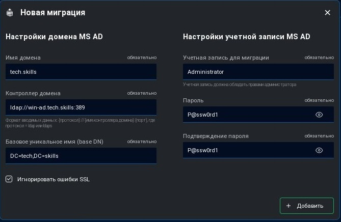
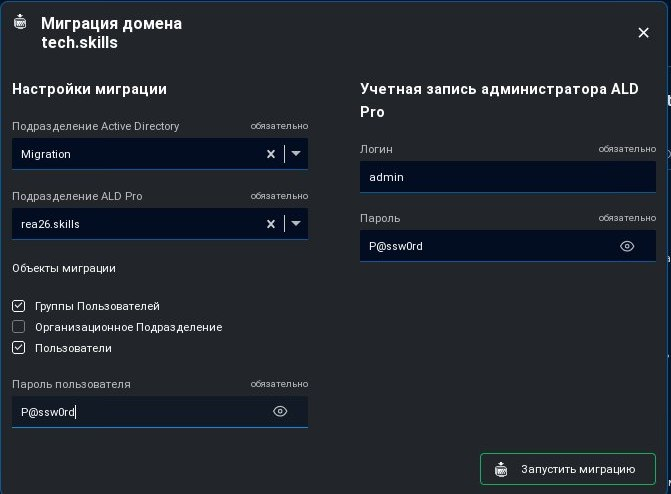

# Подробный мануал по миграции пользователей с AD на ALD для учебного стенда

## Необходимые данные
|Домен        |Сервер |Адрес         |LDAP             |Уз Админа     |
|-------------|-------|--------------|-----------------|--------------|
|tech.skills  |win-ad |192.168.1.15  |Active Directory |Administrator |
|rea26.skills |cr-db  |192.168.1.10  |ALD Pro          |admin         |

---

## Шаг 1: Настройка IP-адреса на сервере AD
1. Подключитесь к серверу `win-ad.tech.skills`
2. Установите статический IP-адрес в соответствии с сетевой схемой учебного стенда (192.168.1.15)
---

## Шаг 2: Отключение безопасности LDAP в групповых политиках
1. В поисковеке набрать `Local Security`, открыть `Local Security Options`
2. В редакторе групповых политик перейдите в:
   -  `Local Security Options` → `Local Options` → `Security Options`
3. Найдите и настройте следующие параметры:
   - **"Domain controller: LDAP server channel binding token requirements"** → `Never`
   - **"Domain controller: LDAP server signing requirements"** → `None`
   - **"Domain controller: LDAP server signing requirements Enforcement"** → `Disabled`
4. Примените изменения и обновите групповую политику командой `gpupdate /force`

---

## Шаг 3: Настройка DNS-форвардинга в ALD
1. Подключитесь к веб-интерфейсу ALD (`cr-db.tech.skills`)
2. Перейдите в раздел DNS-настроек
3. Добавьте новый форвардер:
   - **Домен:** `tech.skills`
   - **IP-адрес:** `192.168.1.15`
4. Сохраните настройки

---

## Шаг 4: Проверка видимости AD через ldapsearch
Выполните на сервере ALD:
```bash
ldapsearch -x -H ldap://win-ad.tech.skills -b "DC=tech,DC=skills" -s base
```
Если в ответе видны атрибуты домена (например, objectClass: top, objectClass: domain), значит соединение установлено корректно.

---

## Шаг 5: Настройка параметров миграции
В интерфейсе миграции укажите следующие параметры:

### Настройки домена MS AD
- **Имя домена**: `tech.skills`
- **Контроллер домена**: `ldap://win-ad.tech.skills:389`
- **Базовое уникальное имя (base DN)**: `DC=tech,DC=skills`
- **Игнорировать ошибки SSL**: ✅ Включено

 

### Настройки учетной записи MS AD
- **Учетная запись для миграции**: `Administrator`
- **Пароль**: `P@ssw0rd1`
- **Подтверждение пароля**: `P@ssw0rd1`

### Настройки миграции
- **Подразделение Active Directory**: `Migration`
- **Подразделение ALD Pro**: `rea26.skills`
- **Объекты миграции**: 
  - Группы Пользователей: ✅ Включено
  - Организационное Подразделение: ❌ Выключено
  - Пользователи: ✅ Включено
- **Пароль пользователя**: `P@ssw0rd`

 

---

## Шаг 6: Проверка SRV-записей (при возникновении ошибок)
Если миграция завершается с ошибкой:
```bash
nslookup -type=srv _ldap._tcp.tech.skills
```
Убедитесь, что возвращается запись, указывающая на `win-ad.tech.skills`

---

## Шаг 7: Валидация успешной миграции
После завершения миграции проверьте:
   - Появление пользователей в интерфейсе ALD
   - Возможность аутентификации пользователей с паролями из AD
---
